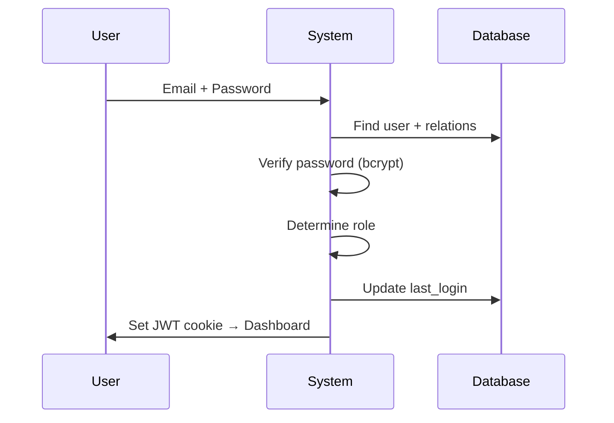
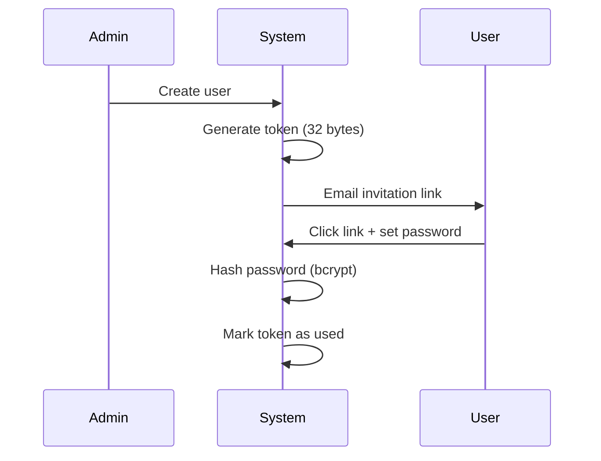
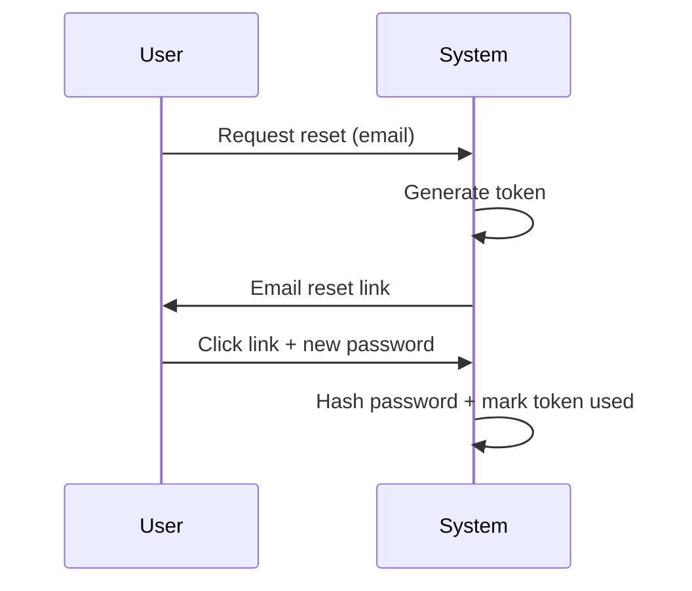
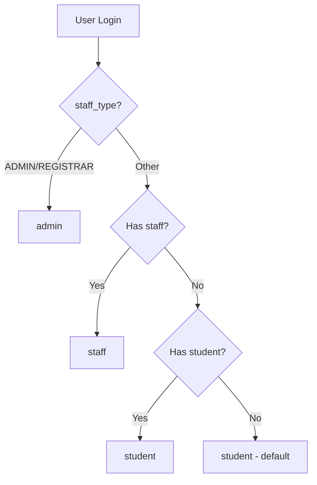

# Authentication Flows

Quick reference for authentication flows in the Student Enrollment & Evaluation System.

---

## 1. Login Flow



**Key Points**:
- Password verification: `bcrypt.compare()`
- Role from database relations (staff/student)
- JWT stored in HTTP-only cookie
- File: `auth.ts`

---

## 2. Registration Flow



**Key Points**:
- Token expiry: 7 days
- Single-use tokens
- Placeholder password until user sets real one
- File: `lib/actions/user-actions.ts`

---

## 3. Password Reset Flow



**Key Points**:
- No email enumeration (same response for all)
- Token expiry: 7 days
- Single-use tokens
- File: `app/api/auth/reset-password/route.ts`

---

## 4. Session Management

**JWT Payload**:
```json
{
  "sub": "user_id",
  "role": "student|staff|admin",
  "firstName": "John",
  "lastName": "Doe",
  "exp": 1708972800
}
```

**Cookie Security**:
- `httpOnly: true` → XSS protection
- `secure: true` → HTTPS only
- `sameSite: 'lax'` → CSRF protection

**Flow**: Login → JWT signed → HTTP-only cookie → Verify on each request

---

## 5. Role Determination



**Priority**: Admin → Staff → Student → Default (student)

---

## Security Features

| Feature | Implementation |
|---------|----------------|
| Password Hashing | bcrypt (10 rounds) |
| Token Generation | crypto.randomBytes(32) |
| Session Storage | HTTP-only cookies |
| Token Expiry | 7 days |
| Single-use Tokens | Database flag |
| CSRF Protection | SameSite cookies |

---

## Recommendations

🔴 **High Priority**:
- Add rate limiting on auth endpoints
- Remove hardcoded admin email checks

🟡 **Medium Priority**:
- Account lockout after failed attempts
- Comprehensive audit logging

🟢 **Low Priority**:
- Password complexity requirements
- Session timeout on inactivity

