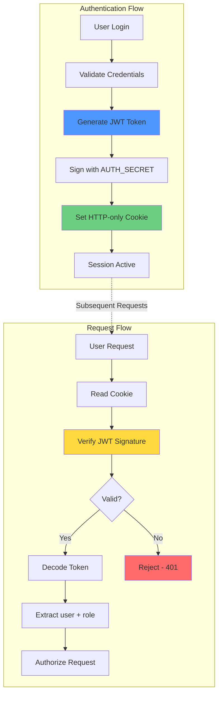
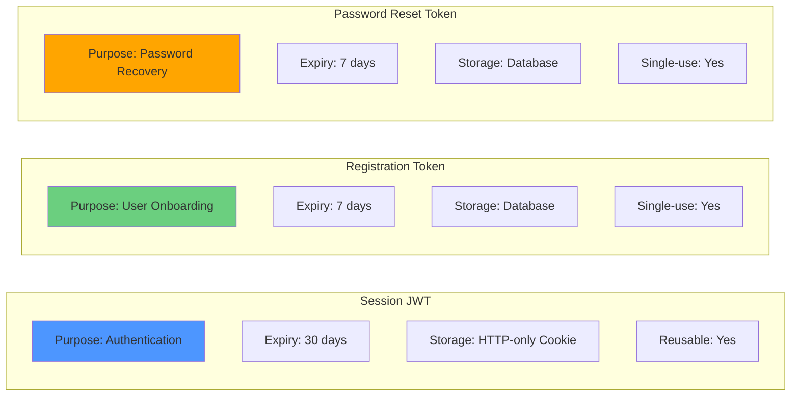
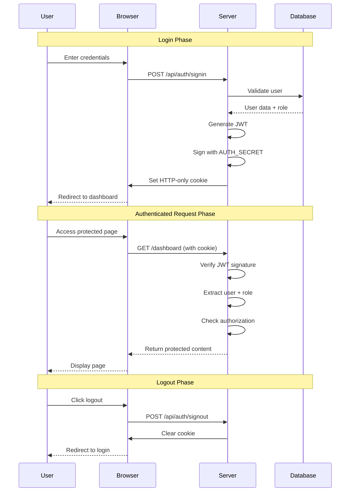
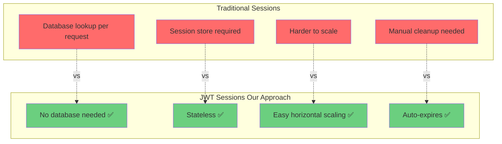

# Session & Token Handling
**Secure, Stateless Authentication with NextAuth.js**

---

## Architecture Overview



---

## Token Types in System



---

## JWT Payload Structure

```json
{
  "sub": "user_id",           // Subject (User ID)
  "role": "student",          // User role for RBAC
  "firstName": "John",        // User first name
  "lastName": "Doe",          // User last name
  "iat": 1706380800,          // Issued at timestamp
  "exp": 1708972800,          // Expiration timestamp
  "jti": "unique-token-id"    // JWT ID
}
```

---

## Security Features

| Feature | Implementation | Benefit |
|---------|----------------|---------|
| 🔒 **HTTP-only** | Cookie flag set | XSS attack prevention |
| 🛡️ **SameSite** | Cookie attribute | CSRF protection |
| ✍️ **Signed** | HMAC-SHA256 | Tampering detection |
| ⏱️ **Time-limited** | JWT expiration | Automatic invalidation |
| 🔐 **Secure** | HTTPS only | Man-in-the-middle protection |

---

## Complete Session Lifecycle



---

## Token Generation Security

### Registration & Reset Tokens
```javascript
crypto.randomBytes(32).toString('hex')
// Generates: 256-bit entropy (64 hex characters)
// Example: "a3f5c8e9d2b1f4a7c6e8d9b2f1a4c7e6..."
```

### JWT Signing
```javascript
HMAC-SHA256(header + payload, AUTH_SECRET)
// Ensures token integrity and authenticity
```

---

## Benefits: JWT vs Traditional Sessions



---

## Key Takeaways

> ✅ **Stateless Architecture**: No database lookups for session validation  
> ✅ **Industry Standard**: JWT with HTTP-only cookies  
> ✅ **Multi-layered Security**: XSS, CSRF, and tampering protection  
> ✅ **Scalable**: Horizontal scaling without session store  
> ✅ **Developer-friendly**: NextAuth.js handles complexity  

---

## Implementation Stack

- **Framework**: NextAuth.js v5 (Auth.js)
- **Token Format**: JWT (JSON Web Tokens)
- **Signing Algorithm**: HMAC-SHA256
- **Storage**: HTTP-only, Secure, SameSite cookies
- **Token Generation**: Node.js `crypto.randomBytes()`
